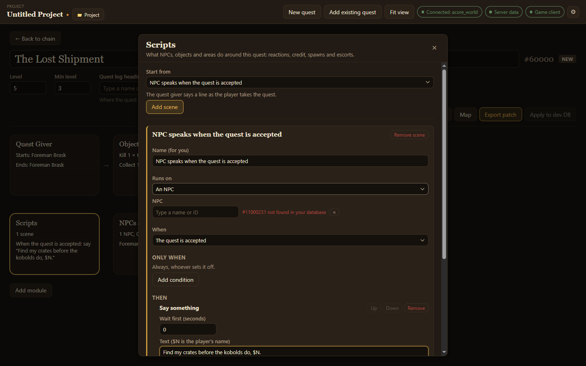

<p align="center">
  
</p>

<p align="center">
  <b>Build and script quests for your AzerothCore server, then export them as SQL.</b><br>
  Givers, objectives, scripting, NPCs and patrols, without editing database tables by hand.
</p>

<p align="center">
  <a href="https://github.com/DMCK96/acore-quest-creator/releases"></a>
  <a href="https://dmck96.github.io/acore-quest-creator/"></a>
  
  <a href="LICENSE"></a>
</p>

<p align="center">
  <a href="https://github.com/DMCK96/acore-quest-creator/releases"><b>Download</b></a>
  &nbsp;·&nbsp;
  <a href="https://dmck96.github.io/acore-quest-creator/"><b>Documentation</b></a>
  &nbsp;·&nbsp;
  <a href="#building-from-source"><b>Build from source</b></a>
</p>

<p align="center">
  
</p>


## What it does

- **Quest chains on a canvas.** Make new quests or bring in existing chains from your world database, and see how they connect.
- **Givers and objectives.** Choose who offers and takes back a quest, and what the player must kill, use, collect or explore.
- **Quest scripting.** Describe what happens around a quest as scenes: an NPC speaks on accept, a talk option gives credit, an escort walks a path.
- **Combat wizard.** Design how an NPC fights, from one ability to a boss with phases, adds and health thresholds.
- **New NPCs and objects.** Pick how they look, their faction and weapons; make readable books and notes, and chests with loot.
- **Quest map.** Place spawns on the world map with the game's zone art, snap them to the ground and draw patrol routes with actions at each point.
- **Test in game.** Get the GM commands to reload and try a quest on your test server.
- **Export.** Review every change, then export an SQL patch or apply it to a dev database. Your live world database is only ever read.

<table>
  <tr>
    <td width="50%"></td>
    <td width="50%"></td>
  </tr>
  <tr>
    <td align="center"><sub><b>Quest scripting</b>: what happens around a quest, as scenes</sub></td>
    <td align="center"><sub><b>Combat wizard</b>: from one ability to a boss with phases</sub></td>
  </tr>
  <tr>
    <td width="50%"></td>
    <td width="50%"></td>
  </tr>
  <tr>
    <td align="center"><sub><b>Quest map</b>: spawns and patrols on the zone art</sub></td>
    <td align="center"><sub><b>NPC editor</b>: looks, faction and weapons</sub></td>
  </tr>
</table>

## Requirements

- An [AzerothCore](https://www.azerothcore.org/) world database (including the Conquest of AzerothCore fork) reachable over MySQL.
- Optional: your server's data folder (the one holding `dbc/`) for XP values, name search and ground heights, and your game client folder for map imagery.

## Download

Get the installer for Windows, macOS or Linux from the [Releases page](https://github.com/DMCK96/acore-quest-creator/releases). The builds are not code-signed, so your system warns you the first time you open the app; [the install guide](https://dmck96.github.io/acore-quest-creator/getting-started/install/) shows how to get past it.

## Documentation

The guide for quest authors and contributors: **https://dmck96.github.io/acore-quest-creator/**

## Building from source

```sh
npm ci
cp .env.example .env   # then fill in your world database
npm run dev
```

See [CONTRIBUTING.md](CONTRIBUTING.md) for tests, conventions and releases.

<p align="center">
  
</p>

## License

[GPL-3.0-or-later](LICENSE).
