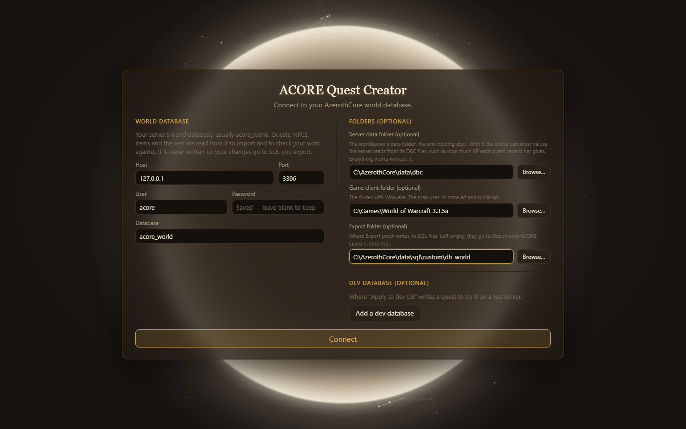

The first screen asks where your world database is. Fill it in once; the app remembers it and offers it again next time.

## World database

Your server's world database, usually `acore_world`. Quests, NPCs, items and the rest are read from it to import and to check your work against. **It is never written to**: your changes go to SQL you export, or to a dev database you add yourself.

- **Host** and **Port**: where MySQL runs, for example `127.0.0.1` and `3306`.
- **User** and **Password**: a MySQL user that can read the world database. Read-only rights are enough.
- **Database**: the world database's name.

The password is stored encrypted on your computer. Once one is saved, the field reads **Saved — leave blank to keep**.

## Folders (optional)

- **Server data folder**: the worldserver's data folder, the one holding `dbc/`. It lets the app show XP values for reward tiers, search spells and creature or object models by name, and snap spawns to the ground on the map. Everything works without it; those parts fall back to typing IDs.
- **Game client folder**: the folder with `Wow.exe`. The quest map uses its zone art and minimap.
- **Export folder**: where **Export patch** writes SQL files, such as your server's `data/sql/custom/db_world`. Left empty, they go to `Documents/ACORE Quest Creator/sql`.

Use **Browse…** to pick a folder instead of typing it.

## Dev database (optional)

**Add a dev database** to turn on **Apply to dev DB**, which writes a quest straight into a test server's world database so you can try it in game. Use a copy of your world database on a test server, never your live one.

## Connect

Choose **Connect**. The top bar then shows what the app reached: **Connected: _database_**, plus **Server data** and **Game client** when those folders opened.

To change any of this later, choose the **⚙** button in the top bar to open **Settings**. Saving there reconnects with the new details and closes the open quest; your project stays open.

Next: [your first quest](/acore-quest-creator/getting-started/first-quest/).
