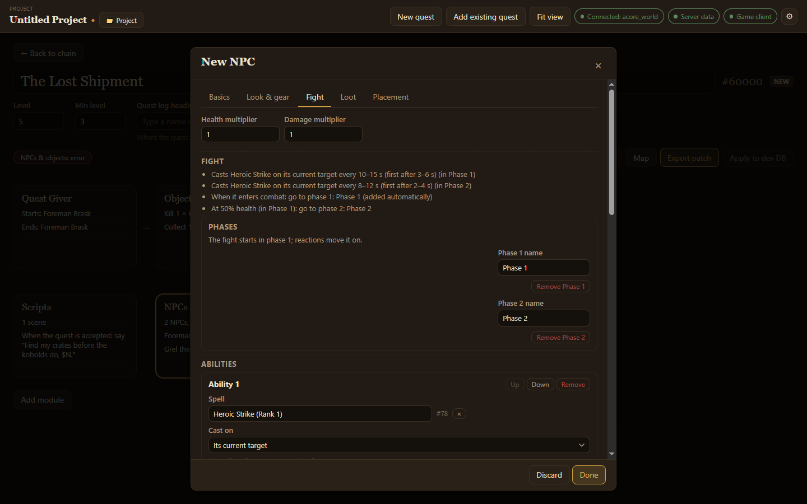

The **Fight** tab of the NPC editor designs how a new NPC fights: which abilities it uses and how often, what it does at certain health, and phases for bosses. You describe the fight; the app writes the server's scripts for it.

## Start from a preset

Pick a preset under **Start from a preset**, then **Add from a preset** to layer more on top:

- Melee with one ability
- Caster
- Flee at 15%
- Enrage at 30%
- Adds at 50%
- Two-phase boss
- Surrenders at 20%

Then change anything the preset filled in.

## What the tab holds

- **Health multiplier** and **Damage multiplier**: how tough the NPC is and how hard it hits.
- **Fight**: a plain-English summary of everything below, such as *Casts Heroic Strike on its current target every 10–15 s (first after 3–6 s) (in Phase 1)*. Read it to check the fight does what you mean.
- **Phases**: named stages of the fight. The fight starts in phase 1; reactions move it on.
- **Abilities**: each one is a **Spell** cast on a target (**Cast on**), first after a random time, then every so often. It can be **Only once**, **Stay at range while it can cast this**, **Don't recast while it is still on them**, and be limited to certain phases.
- **Reactions**: what happens *when it enters combat*, *at a health %*, *when a friend is hurt*, *when one of its adds dies*, *when it kills a player*, *when it dies* or *when it gives up and resets*. A reaction can **Say or yell**, **Emote**, **Cast a spell**, **Summon adds**, **Despawn its adds**, **Go to phase**, **Flee for help**, **Call for help**, **Stop taking damage at** a health %, **Surrender** or **Give quest credit**.

:::tip
With the [server data folder](/acore-quest-creator/getting-started/connect/#folders-optional) connected, type a spell's name to find it. Without it, type the spell ID.
:::

A fight pauses a patrolling NPC's route; it carries on walking after combat.
