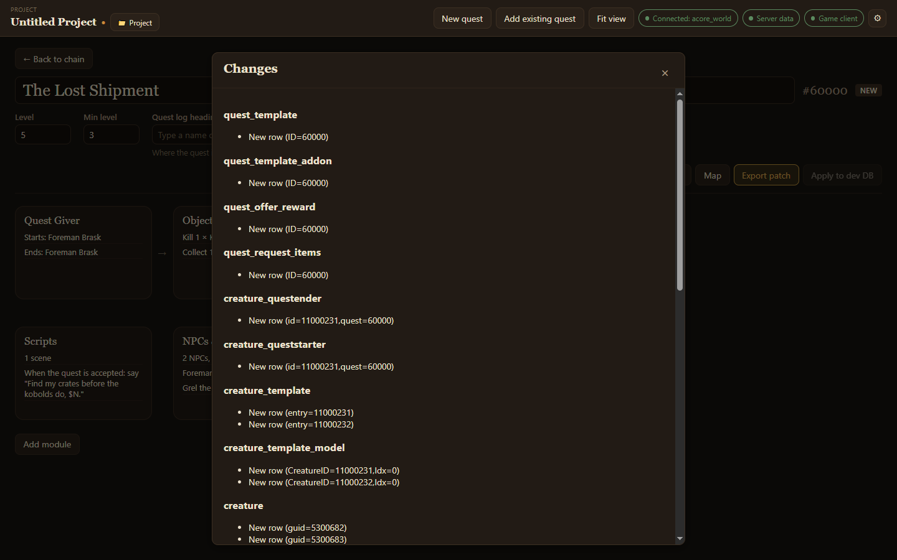

Your work leaves the app as SQL. The quest's header has three buttons for it: **Changes**, **Export patch** and **Apply to dev DB**.

## Review the changes

**Changes** lists every database row the quest adds or changes, grouped by table. An existing quest you opened but did not edit says *No changes since this quest was loaded.*

## Export a patch

**Export patch** writes the quest's changes to an `.sql` file and shows where it saved it. By default files go to `Documents/ACORE Quest Creator/sql`. Run the file against your world database, or hand it to your server admin.

The app refuses to export a quest it cannot write back faithfully. The button is then disabled and says why: *Unsafe to export*. It also refuses while a module has an error, listing what to fix.

## Apply to a dev database

**Apply to dev DB** writes the changes straight into your dev database, after asking you to confirm. It is disabled until you add a dev database in [Settings](/acore-quest-creator/getting-started/connect/#dev-database-optional).

Then [test it in game](/acore-quest-creator/guides/test-in-game/).

:::caution
The dev database should be a copy on a test server. Never point it at your live world database.
:::
