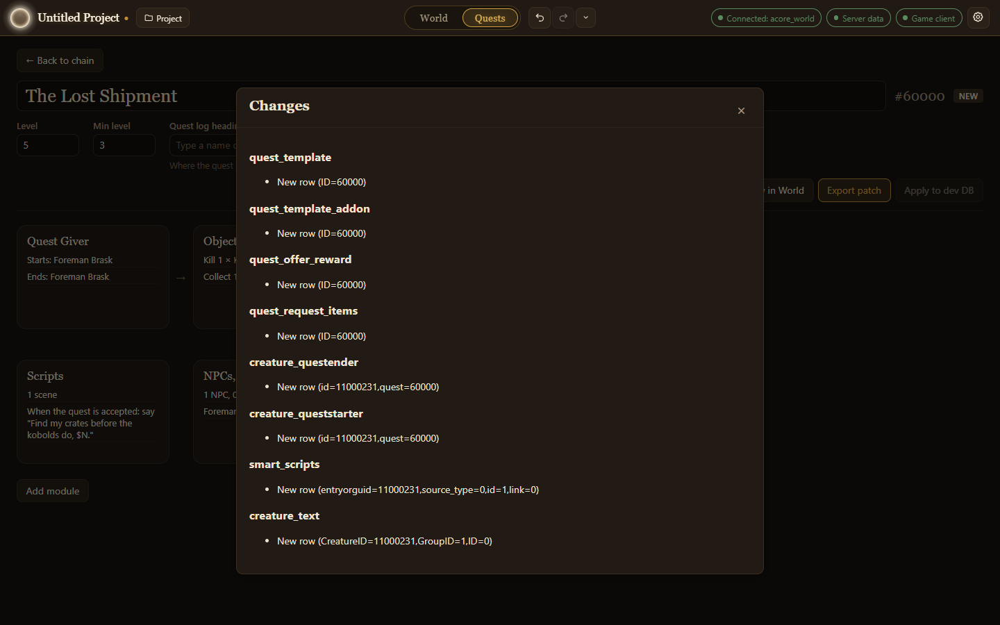

Your work leaves the app as SQL. The quest's header has three buttons for it: **Changes**, **Export patch** and **Apply to dev DB**.

## Review the changes

**Changes** lists every database row the quest adds or changes, grouped by table. An existing quest you opened but did not edit says *No changes since this quest was loaded.*

## Export a patch

**Export patch** writes the quest's changes to an `.sql` file and shows where it saved it. The quest's patch holds the quest itself. The new NPCs, objects and items it uses are in the [project patch](#the-project-patch): when the quest uses any, the export says so and offers **Export project patch** too. Run the project patch first. Files go to the **Export folder** set in [Settings](/azeroth-world-editor/reference/settings/#folders), or to `Documents/Azeroth World Editor/sql` when none is set. Run the file against your world database, or hand it to your server admin.

The app refuses to export a quest it cannot write back faithfully. The button is then disabled and says why: *Unsafe to export*. It also refuses while a module has an error, listing what to fix.

## Apply to a dev database

**Apply to dev DB** writes the changes straight into your dev database, after asking you to confirm. It applies the project patch first, then the quest's, so the quest's NPCs are there. It is disabled until you add a dev database in [Settings](/azeroth-world-editor/getting-started/connect/#dev-database-optional).

Then [test it in game](/azeroth-world-editor/guides/test-in-game/).

## The project patch

The project's new [NPCs, objects and items](/azeroth-world-editor/guides/npcs-and-objects/), and the changes made in [the World](/azeroth-world-editor/guides/the-world/) to spawns already in the database (moved or placed spawns, changed routes, new paths and wander), are not part of any quest's patch. Open **Project changes** in the World's Layers card and choose **Export project patch**, or choose it after a quest's export. It writes two files to the same export folder, numbered per day:

- `<date>_<nn>_project.sql`: the new NPCs, objects and items, and the changes.
- `<date>_<nn>_project_revert.sql`: puts the database back as it was before them.

Run the project patch before the quests' patches. It replaces the world patch (`_world.sql`) of earlier versions.

A spawn placed in the World is written with a new spawn ID, and the patch deletes that ID first so it can be run again. An NPC given a new path gets its own addon row, copied from its template's so it keeps its mount and auras.

:::caution
The dev database should be a copy on a test server. Never point it at your live world database.
:::
