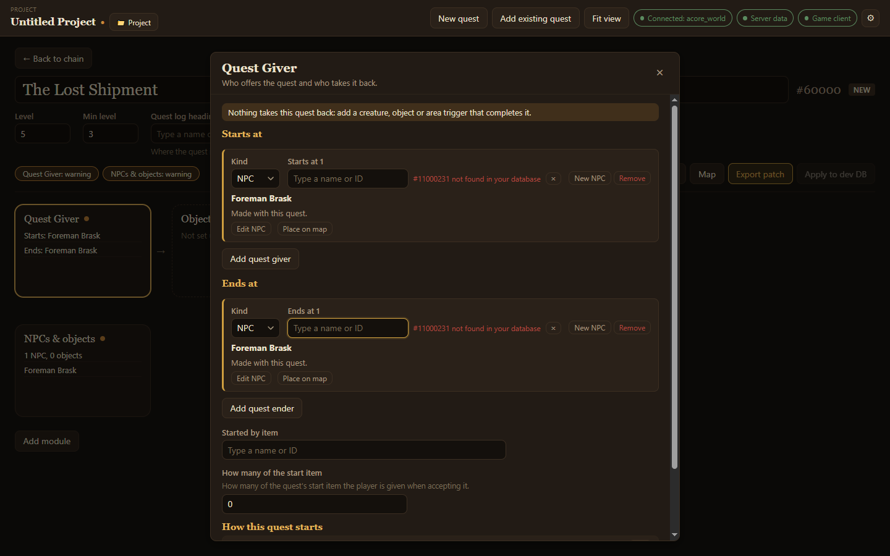

The **Quest Giver** module says who offers the quest (**Starts at**) and who takes it back (**Ends at**).

## Add a giver

1. Open **Quest Giver** and choose **Add quest giver**.
2. Pick the **Kind**: an NPC or an object.
3. Either type the name or ID of one that already exists, or choose **New NPC** to make one just for this quest. The [NPC editor](/acore-quest-creator/guides/npcs-and-objects/) opens; choose **Done** when it looks right.

A new NPC is marked **Made with this quest**. Its card offers **Edit NPC**, **Place on map** and, once placed, **Draw patrol**.

## Add an ender

Choose **Add quest ender** and pick who takes the quest back in the same way. Without an ender, the module warns: *Nothing takes this quest back*.

## Other ways a quest starts

- **Started by item**: an item that starts the quest when used, and **How many of the start item** the player is given when accepting it.
- **How this quest starts** sums up what you set, such as *Offered by NPC …*.
- **What this quest unlocks** shows which quest this one leads to, if any.

## Put the giver in the world

Choose **Place on map** on the giver's card to open the [quest map](/acore-quest-creator/guides/quest-map/) and click where the NPC should stand. From there you can also draw its [patrol](/acore-quest-creator/guides/patrols/).
