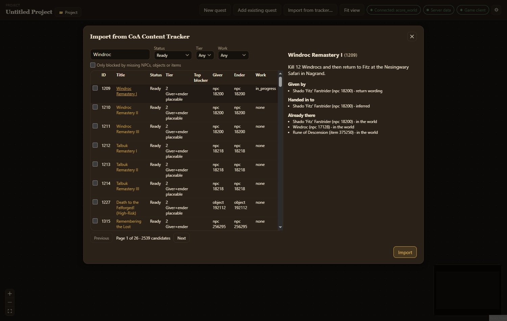

The [CoA Content Tracker](https://github.com/DMCK96/coa-content-tracker) is a separate app, run on your own computer, that lists every quest Conquest of Azeroth had on Ascension and grades each one against your world database. **Import from tracker…** brings those quests into your project, ready to finish and export.

## Set it up

1. Start the tracker: `python tracker.py` in its folder. It listens on `http://127.0.0.1:8089`.
2. If you run it on another port, set **CoA Content Tracker URL** in **Settings**. Only an address on this computer is accepted.

## Find a quest

Choose **Import from tracker…** in the top bar. The dialog lists the tracker's candidates:

- search by title or quest ID;
- **Status** starts on **Ready** (everything the quest needs exists or has full data). **Needs work** and **Stub (title only)** show the rest;
- **Tier** and **Work** narrow by the tracker's grade and your own work state;
- **Only blocked by missing NPCs, objects or items** lists quests this import can unblock, because it creates what's missing.

Quests already in your project say **In project** in the **Work** column.

## Read the preview

Choose a quest's title to see what importing it does:

- **Given by** and **Handed in to**: each giver and ender, and how the tracker found it (`recorded`, `inferred`, `supertrack`, `return wording`, `board` for the Hero's Call Board). Anything not `recorded` is the tracker's best guess, so check it;
- **Will be created**: NPCs, objects and items your world database doesn't have. They are made from Ascension's data, with their spawns when known;
- **Already there**: what the quest names that the world, your project or this same import already has;
- **Unresolved**: something the quest needs that the tracker has no data for. The quest still imports; its validation tells you what to fix;
- **Not imported**: columns the app has no place for, and spawns known only as a spot on a zone map (place those on the [quest map](/acore-quest-creator/guides/quest-map/));
- **The tracker's blockers**: why the tracker graded it as it did.

## Import

- **Import** brings in the quest you're previewing, and opens it.
- Tick several quests and choose **Import *n* selected** to bring them in together. An NPC, object or item they share is created once.

If a quest is already in your project, you're asked once whether to replace it with the tracker's data. Replacing loses your edits to that quest. Anything it made that another quest in your project still uses is kept and moved to that quest.

## What an import keeps

- The quest keeps its **Ascension quest ID**, and new NPCs, objects and items keep their **Ascension entries**. Other quests and the tracker know them by those numbers, so chains stay linked. Only spawn IDs are new.
- In the tracker, the quest's work state becomes **in progress**, noting the project it went into. After you apply the quest and the tracker takes its next snapshot, it shows as **In CoA world**.
- Imported items keep every column the tracker had. Ones the item editor doesn't show are under [advanced fields](/acore-quest-creator/guides/items/#advanced-fields).
