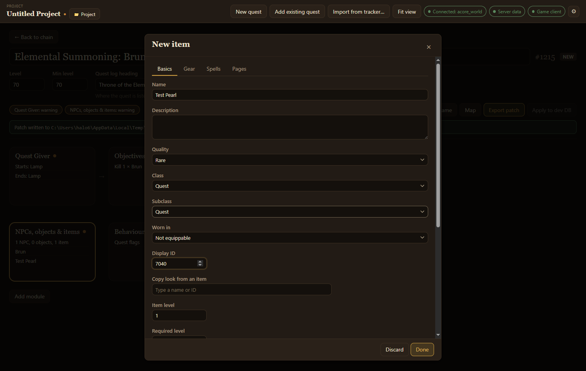
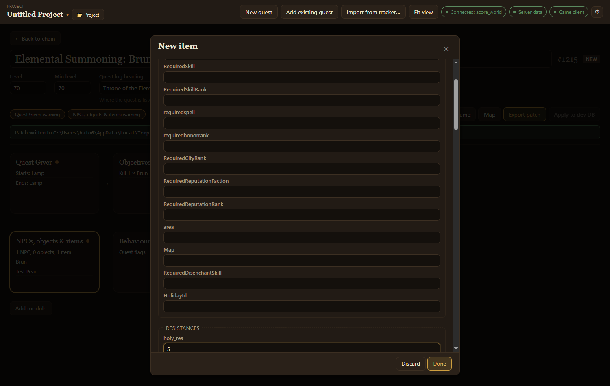

A quest often needs an item the world database doesn't have yet: a letter to deliver, a trophy to collect, or a reward to hand out. An item belongs to your project, and a quest uses it by naming it as a required item, a drop or a reward. You make one in the **NPCs, objects & items** module, next to the project's NPCs and objects.

## Make a quest item

1. In **NPCs, objects & items**, choose **Add item**.
2. On **Basics**, give it a **Name**. A new item starts as a quest item: class **Quest**, **Binding** set to **Quest item**, one per stack, and at most one carried.
3. Set **Display ID** to the model and icon it should use, or pick an item under **Copy look from an item** to copy its look, class, subclass and slot.
4. Choose **Done**.

The item can now be picked anywhere the quest asks for an item: required items in **Objectives**, drops in loot lists, and **Rewards**. It shows in those searches marked **new**.

## Make a reward

1. **Add item**, name it, and set **Quality**, **Class**, **Subclass** and **Worn in** (the slot).
2. On **Gear**, set **Armor**, and for a weapon its **Damage** and **Weapon speed (ms)**. **Add stat** adds a stat such as **+12 Stamina**; an item has at most ten.
3. On **Spells**, **Add spell** for an effect: when it happens (**Use**, **On equip**, **Chance on hit**…), and its charges and cooldowns. An item has at most five.
4. Set **Required level**, **Item level**, and the **Buy price** and **Sell price** in copper on **Basics**.

Consumables, trade goods and quest items aren't worn, so **Gear** starts hidden for them. **Show gear fields anyway** shows them.

## Change an item that already exists

Pick an item the database already has in any item picker, such as a reward, and choose **Edit…**. The editor opens with its title ending in **(existing)**. It needs the world database connected.

The first edit adds the item to the project (one undo step) and lists it as **Details changed**. Nothing in the database changes until you apply the project patch, which writes the item's row with your changes over it, so fields the editor does not show stay as they were. **Put back as the database has it** takes your changes away again. See [NPCs and objects](/acore-quest-creator/guides/npcs-and-objects/#change-one-that-already-exists) for how editing an existing one works.

## Readable items

On **Pages**, **Add page** and write the text. Right-clicking the item in game shows the first page, and the player turns to the next.

## Starting a quest

**Starts a quest** on **Basics** makes the item begin a quest when the player uses it. The canvas links the item to that quest.

## Advanced fields

`item_template` has many more columns: requirements, resistances, sockets, sets, flags, durability and more. Tick **Show advanced fields** to add an **Advanced** tab listing every other column your database has, grouped. An empty box keeps the column's default.

The app remembers whether you show them. If they are hidden but the item has values in some of them, the editor tells you with the note **Some advanced fields have values**.

## What export writes

Each new item becomes an `item_template` row, and a readable item's pages become `page_text` rows. Export deletes and re-inserts them each time, so the SQL always matches the project.

The item's look comes from the game client: a **Display ID** the client doesn't have shows as a question mark. An item without one exports with a warning.
