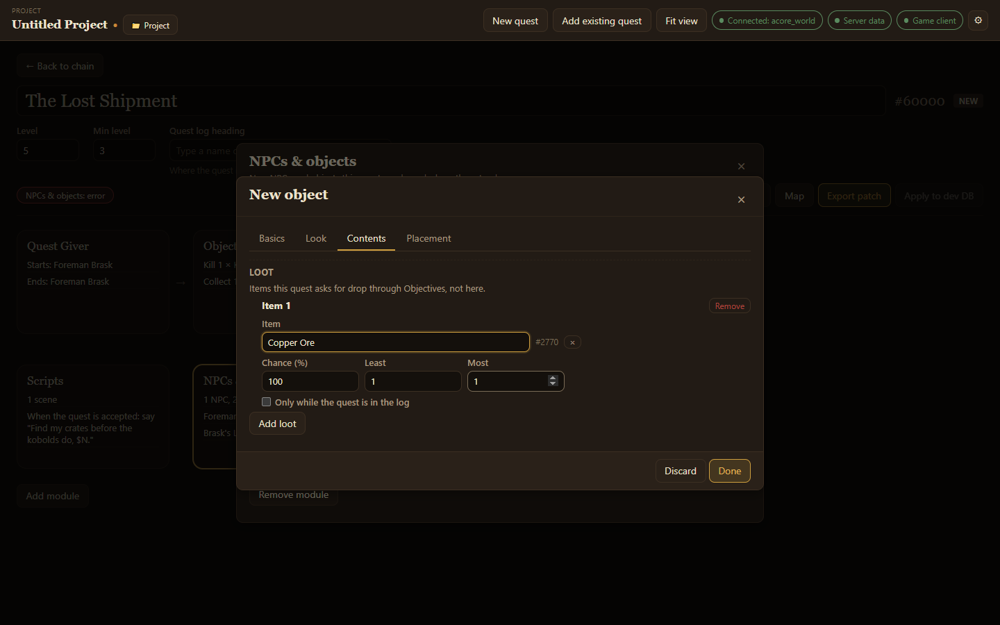

New NPCs have a **Loot** tab, and chests have a **Contents** tab, for what a player gets from them.

## Add loot

1. Open the NPC or chest and go to **Loot** (NPC) or **Contents** (chest).
2. Choose **Add loot** and type the **Item**.
3. Set the **Chance (%)**, and the **Least** and **Most** of it that drop.
4. Tick **Only while the quest is in the log** for loot only players on the quest should get.

## Loot versus quest items

Items the quest asks the player to collect are set up in **Objectives**, under **Drop sources**, not here. See [Quest details, objectives and rewards](/acore-quest-creator/guides/quest-details-and-objectives/#objectives). Use loot for everything else a creature or chest gives.
