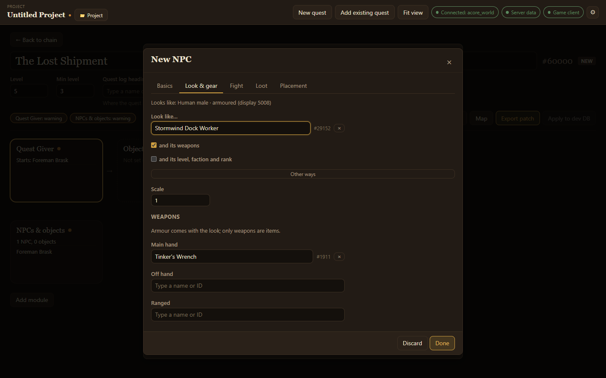

The **NPCs & objects** module lists the new NPCs and objects a quest needs and where they stand. Making a new NPC from the [Quest Giver](/acore-quest-creator/guides/givers-and-enders/) module adds this module for you.

- **Add NPC** and **Add object** open the editor for a new one.
- **Edit** on a listed NPC or object opens it again.

New NPCs and objects are created in the quest as soon as you choose **Done**. **Discard** throws the changes away.

## The NPC editor

The editor has tabs:

- **Basics**: name, title (the line under the name), minimum and maximum level, and faction. Faction buttons such as **Stormwind** set a common one in a click.
- **Look & gear**: how the NPC looks. Type a creature under **Look like…** to borrow its appearance. Tick **and its weapons** to borrow its weapons too, or **and its level, faction and rank** to borrow those. **Other ways** lets you browse models by name or type a display ID. **Scale** makes it bigger or smaller. Under **Weapons** you can pick main hand, off hand and ranged items yourself; armour always comes with the look.
- **Fight**: how it fights. See the [combat wizard](/acore-quest-creator/guides/combat-wizard/).
- **Loot**: what it drops. See [Loot](/acore-quest-creator/guides/loot/).
- **Placement**: where it stands. **Add spawn**, then either paste the output of the in-game `.gps` command or place it on the [quest map](/acore-quest-creator/guides/quest-map/).

## The object editor

Objects have **Basics**, **Look**, **Placement**, and for some types **Contents**. On **Basics**, pick the **Type**:

| Type | What it is |
| --- | --- |
| Usable object | Something the player clicks, such as a lever or a quest item on the ground. Can show pages of text. |
| Chest (can be looted) | Something the player loots. Its **Contents** tab holds its loot. |
| Quest giver | An object that offers or takes back quests, such as a wanted poster. |
| Readable | A book, note or plaque. See [Readable objects](/acore-quest-creator/guides/readable-objects/). |
| Decoration | Scenery with nothing to use. |

Usable objects and chests can be **Only usable while this quest is in the log**.

On **Look**, **Other ways** lets you **Browse models** by name, such as `chest` or `book`.

:::tip
Without the [server data folder](/acore-quest-creator/getting-started/connect/#game-files-optional), models and spells cannot be searched by name. Type their IDs instead.
:::
