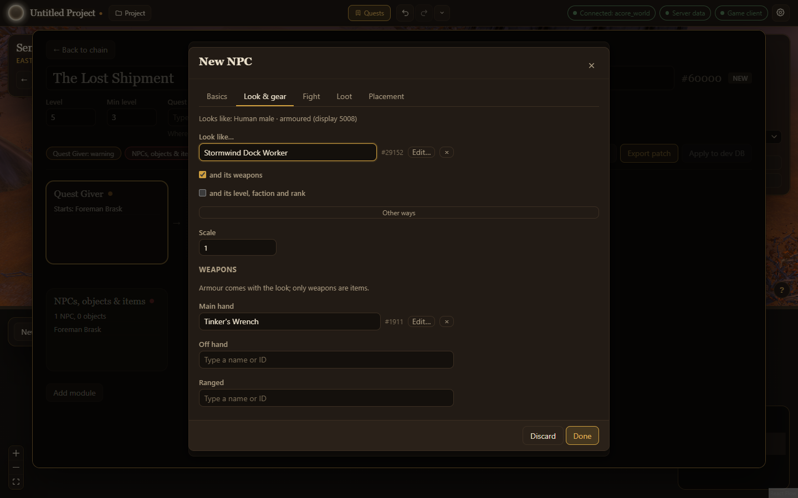

New NPCs, objects and [items](/acore-quest-creator/guides/items/) belong to your project, not to one quest. Any quest in the project can use them: as its giver or ender, an objective, a reward, or in a script.

A quest's **NPCs, objects & items** module lists the ones it uses, and the ones made for it. Making a new NPC from the [Quest Giver](/acore-quest-creator/guides/givers-and-enders/) module adds this module for you.

- **Add NPC** and **Add object** make a new one for this quest and open its editor.
- **Add from project…** lists the project's other NPCs, objects and items, and adds the one you pick to this quest.
- **Edit** on a listed NPC or object opens it again. A line under it says which other quests use it, so you know what a change affects.

A new NPC or object is in the project as soon as you add it, and every change is kept as you make it. **Discard** on a new one takes it away again. Deleting one tells you which quests use it, and takes it off their giver and ender cards. Like every change, both are undone with **Ctrl+Z**.

You can also make them straight in [the World](/acore-quest-creator/guides/the-world/#new-npcs-and-objects): right-click the ground and choose **New NPC here…** or **New object here…**.

## The NPC editor

The editor has tabs:

- **Basics**: name, title (the line under the name), minimum and maximum level, and faction. Faction buttons such as **Stormwind** set a common one in a click.
- **Look & gear**: how the NPC looks. Type a creature under **Look like…** to borrow its appearance. Tick **and its weapons** to borrow its weapons too, or **and its level, faction and rank** to borrow those. **Other ways** lets you browse models by name or type a display ID. **Scale** makes it bigger or smaller. Under **Weapons** you can pick main hand, off hand and ranged items yourself; armour always comes with the look.

:::note[Weapons only need a display]
An NPC holds a weapon by its item's display alone, so any item works, even one your database lists without a proper name (it may show as `[MISSING ITEM NAME]`). The NPC still holds it in game.
:::
- **Fight**: how it fights. See the [combat wizard](/acore-quest-creator/guides/combat-wizard/).
- **Loot**: what it drops. See [Loot](/acore-quest-creator/guides/loot/).
- **Placement**: where it stands. **Add spawn**, then either paste the output of the in-game `.gps` command or place it on the [quest map](/acore-quest-creator/guides/quest-map/).

## The object editor

Objects have **Basics**, **Look**, **Placement**, and for some types **Contents**. On **Basics**, pick the **Type**:

| Type | What it is |
| --- | --- |
| Usable object | Something the player clicks, such as a lever or a quest item on the ground. Can show pages of text. |
| Lootable | Something the player loots, such as a chest. Its **Contents** tab holds its loot. |
| Quest giver | An object that offers or takes back quests, such as a wanted poster. |
| Readable | A book, note or plaque. See [Readable objects](/acore-quest-creator/guides/readable-objects/). |
| Decoration | Scenery with nothing to use. |

Usable and lootable objects can be **Only usable while this quest is in the log**.

On **Look**, **Other ways** lets you **Browse models** by name, such as `chest` or `book`.

:::tip
Without the [server data folder](/acore-quest-creator/getting-started/connect/#folders-optional), models and spells cannot be searched by name. Type their IDs instead.
:::
