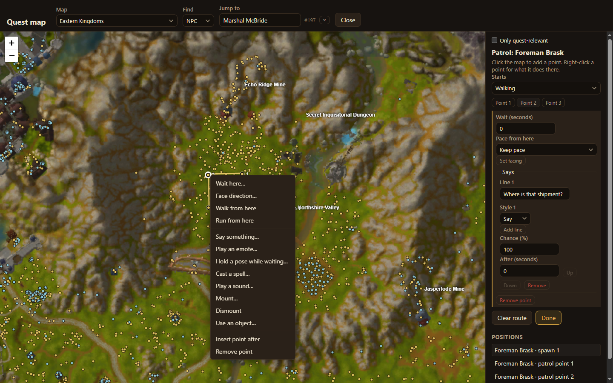

A **patrol** is a route a new NPC walks, over and over. At each point it can wait, say something, play an emote and more.

## Draw a route

1. Place the NPC on the [quest map](/acore-quest-creator/guides/quest-map/).
2. Choose **Draw patrol**. The panel shows **Patrol: _name_**.
3. Click the map to add points in order. Each shows as **Point 1**, **Point 2** and so on.
4. Choose **Done**.

Under **Starts**, choose whether the NPC sets off walking or running. **Clear route** removes every point.

The NPC walks from its spawn through each point and back to where it stands, then starts again.

## What happens at a point

Right-click a point for its actions:

- **Wait here…**: stand still for a number of seconds.
- **Face direction…**: turn to face a direction.
- **Walk from here** / **Run from here**: change pace for the rest of the route.
- **Say something…**: say one or more lines, each with a style (say, yell…), a chance and a delay.
- **Play an emote…**, **Hold a pose while waiting…**
- **Cast a spell…**, **Play a sound…**
- **Mount…**, **Dismount**
- **Use an object…**
- **Insert point after**, **Remove point**

Choose a point's button in the panel to edit its settings there.

:::note
A fight pauses the patrol; the NPC carries on after combat. A new or changed patrol starts after a server restart.
:::
