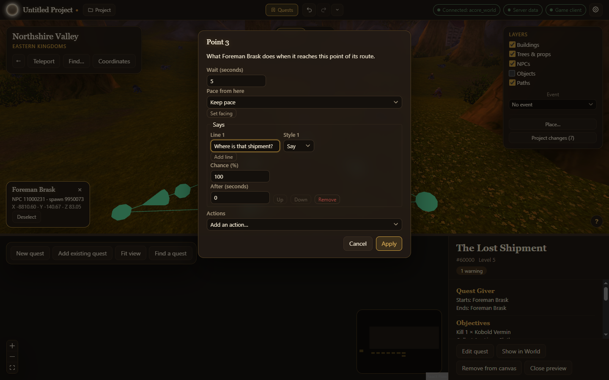

A **patrol** is a route a new NPC walks, over and over. At each point it can wait, say something, play an emote and more.

## Draw a route

1. Place the NPC in the world with **Place in world** on its card (or **Add spawn** in its editor).
2. Choose **Draw patrol** on its card, or beside one of its spawns under **Placement** in its editor. The editor steps aside and [the World](/azeroth-world-editor/guides/the-world/) goes to that spawn.
3. Click the ground to add points in order. **Enter** finishes the path and brings the editor back; **Done** does the same.

An NPC that already patrols offers **Edit patrol** instead: its route is shown to drag, and **Shift-click** adds a point. **Done** brings the editor back.

On the [quest map](/azeroth-world-editor/guides/quest-map/), **Draw patrol** on a selected spawn draws a route by clicking the map. Under **Starts**, choose whether the NPC sets off walking or running. **Clear route** removes every point.

The NPC walks from its spawn through each point and back to where it stands, then starts again.

## What happens at a point

Right-click a point for its actions:

- **Wait here…**: stand still for a number of seconds.
- **Face direction…**: turn to face a direction.
- **Walk from here** / **Run from here**: change pace for the rest of the route.
- **Say something…**: say one or more lines, each with a style (say, yell…), a chance and a delay.
- **Play an emote…**, **Hold a pose while waiting…**
- **Cast a spell…**, **Play a sound…**
- **Mount…**, **Dismount**
- **Use an object…**
- **Insert point after**, **Remove point**

Choose a point's button in the panel to edit its settings there. In the World, right-click a point of the route and choose **Point settings…** for the same settings (the facing is typed in degrees there, and an object to use is given by its spawn guid and picked by name).

:::note
A fight pauses the patrol; the NPC carries on after combat. A new or changed patrol starts after a server restart.
:::
