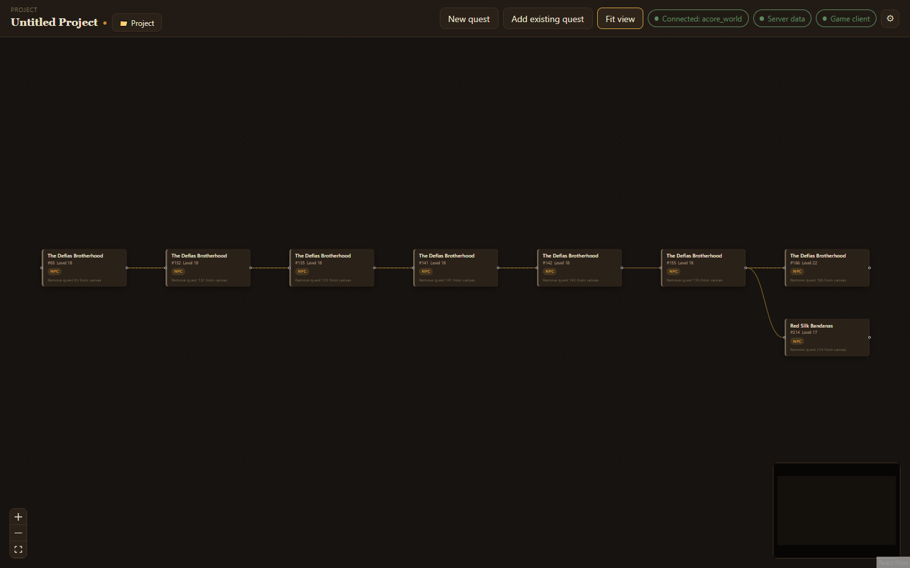

After you connect, the app opens on the **canvas**: every quest in your project as a card, with lines showing which quest leads to which.

## Add quests

- **New quest** makes a quest from scratch and opens it straight away.
- **Add existing quest** searches your world database by name or ID. Picking one brings in its **whole chain**: the quest you picked and every quest chained to it.

Choose a card to preview the quest in a panel on the right: its giver, objectives, dialogue, rewards and more at a glance. From the preview, **Edit quest** opens it, **Remove from canvas** takes it off the canvas (your database is not touched) and **Close preview** hides the panel.

## Find your way around

- Drag the canvas to move around; scroll to zoom.
- **Fit view** in the top bar zooms to show every quest.
- The small map in the corner shows where you are on a large canvas.

When you are inside a quest, **← Back to chain** returns to the canvas.

## Projects

Everything on the canvas is one **project**. Choose **Project** in the top bar to:

- **Save** or **Save As…** the project as an `.aqc` file,
- **Open…** another project, or pick one from **Recent projects**,
- start a **New project…**.

The project's name shows in the top bar, with a dot beside it while there are unsaved changes. Closing the app with unsaved changes asks whether to save.

:::tip[Recovering unsaved work]
The app keeps a recovery copy of your work in the background. If it closes unexpectedly, it offers to restore that work the next time you connect.
:::
