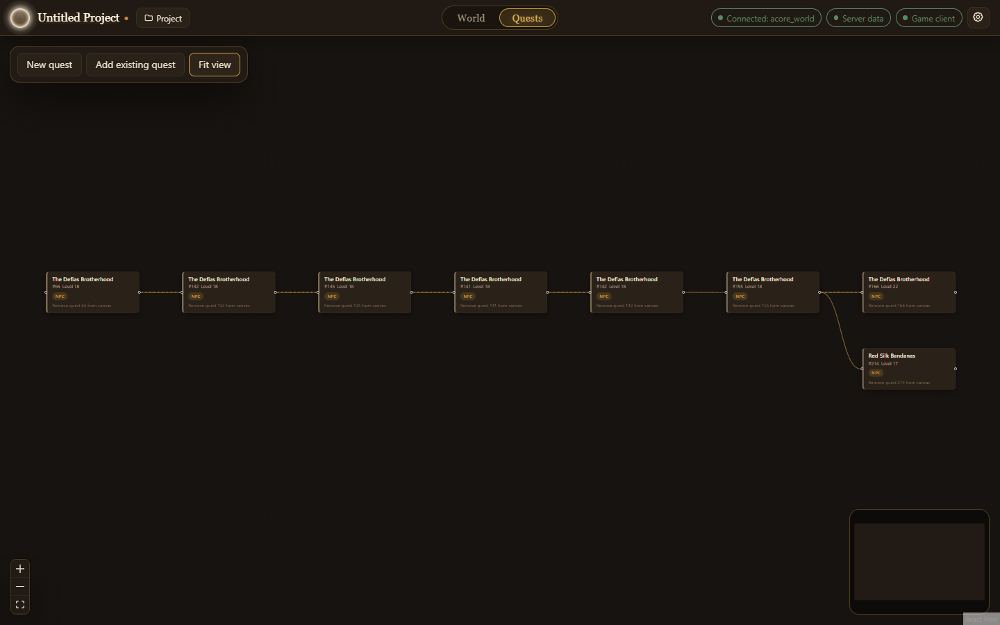
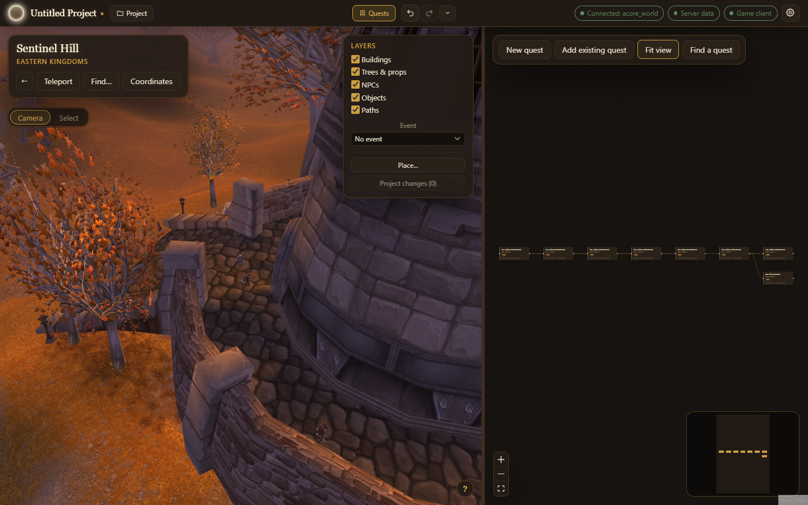

After you connect, the app opens on the **World**, with the **Quests** dock closed. Your quests are in the dock: choose **Quests** in the top bar and it opens under the World (or beside it: see **Preferences** in [Settings](/azeroth-world-editor/reference/settings/)). It holds the **canvas**, with every quest in your project as a card and lines showing which quest leads to which. Drag the bar between the World and the dock to resize it. Opening a quest from anywhere opens the dock; opening and closing it keeps both where you left them. **Find a quest**, among the quest tools, searches the database for a quest to open.

## Add quests

- **New quest** makes a quest from scratch and opens it straight away.
- **Add existing quest** searches your world database by name or ID. Picking one brings in its **whole chain**: the quest you picked and every quest chained to it.

Choose a card to open the quest: the World flies to its NPCs, and a preview beside the graph (under it, when the dock is beside the World) shows its giver, objectives, dialogue, rewards and more at a glance. The open quest's card lists its NPCs and objects (givers, enders and objectives); the one you selected in the World, or last went to, is marked. Drag one of them onto the World to place a spawn of it where you drop it, facing you; it is one step you can undo, and an NPC or object can have more than one spawn. One that already stands somewhere in the world is marked **Placed**, so a second drop is a choice, not an accident. From the preview, **Edit quest** (or a double-click on the card) opens the quest editor over the World, **Remove from canvas** takes it off the canvas (your database is not touched) and **Close preview** hides the panel.

## Link quests

Drag from the dot on the right of one quest's card to the dot on the left of another to make turning in the first unlock the second. The link is drawn at once and is one step you can [undo](/azeroth-world-editor/guides/undo/). A link is refused, with a message saying why, when it would lead a quest to itself, when the two quests are already linked, when the second quest already unlocks after a different quest, or when it would make a loop (the second quest already leads round to the first). Links are made with the quest editor closed.

Right-click a line for what you can do with it. **Remove link** takes away a turn-in link made this way. Other kinds of link, such as a quest offered straight away or a breadcrumb, show **Edit in the quest editor**, which opens the quest that holds the link.

## Find your way around

- Drag the canvas to move around; scroll to zoom.
- **Fit view**, with **New quest** and **Add existing quest** in the quest tools at the top left, zooms to show every quest.
- The small map in the corner shows where you are on a large canvas.

In the quest editor, **← Back to chain** or **Esc** closes it and returns to the dock.

## Projects

Everything in the app, the quests and your changes to the world, is one **project**. Choose **Project** in the top bar to:

- **Save** or **Save As…** the project as an `.awe` file (projects saved as `.aqc` by older versions open too),
- **Open…** another project, or pick one from **Recent projects**,
- start a **New project…**.

The project's name shows in the top bar, with a dot beside it while there are unsaved changes. Closing the app with unsaved changes asks whether to save.

:::tip[Recovering unsaved work]
The app keeps a recovery copy of your work in the background. If it closes unexpectedly, it offers to restore that work the next time you connect.
:::
