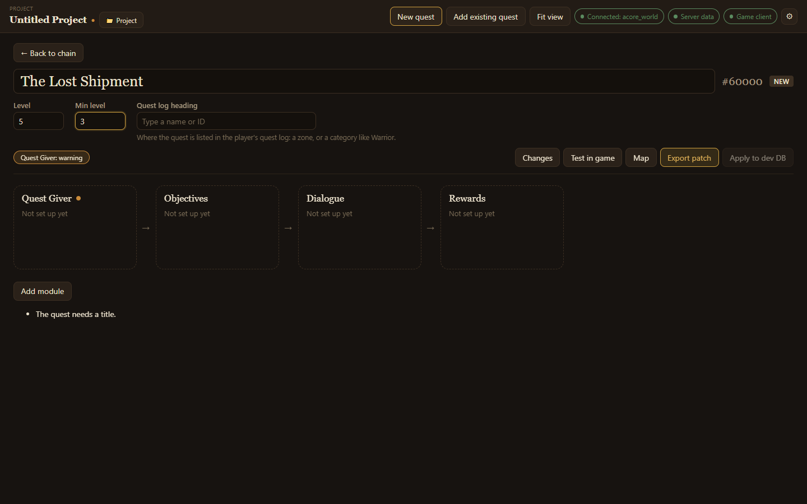
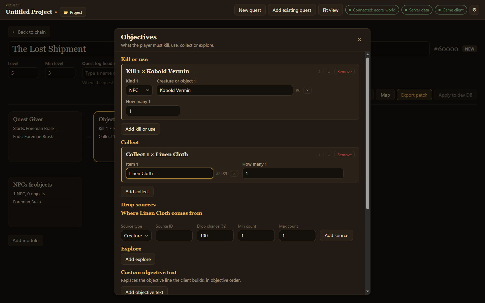

Opening a quest shows its title and levels at the top and its **modules** below. Each module is one part of the quest; choose a module's card to open its editor.

## The quest itself

- **Quest title**: the name players see.
- **Level** and **Min level**: the quest's level and the lowest level that can take it.
- **Quest log heading**: where the quest is listed in the player's quest log, either a zone or a category like Warrior. Type a name or ID.
- The quest's ID shows beside the title, marked **NEW** for a quest you made.

## Modules

Every quest has four core modules:

| Module | What it covers |
| --- | --- |
| Quest Giver | Who offers the quest and who takes it back. See [Quest givers and enders](/acore-quest-creator/guides/givers-and-enders/). |
| Objectives | What the player must kill, use, collect or explore. |
| Dialogue | What the quest giver says when offering, checking and completing the quest. |
| Rewards | The experience, money, items and reputation the quest gives. |

**Add module** adds optional ones when you need them:

| Module | What it covers |
| --- | --- |
| Requirements | Who can take the quest: level cap, races, classes, skills and reputation. |
| Chain | The quests that come before and after this one. |
| Scripts | What NPCs, objects and areas do around this quest. See [Quest scripting](/acore-quest-creator/guides/quest-scripting/). |
| NPCs & objects | New NPCs and objects this quest needs, and where they stand. See [NPCs and objects](/acore-quest-creator/guides/npcs-and-objects/). |
| Timer | A time limit the quest fails after. |
| Behaviour | Sharing, daily or weekly repeats, auto-complete and other quest flags. |
| Map marker | Where the quest points on the world map. |
| Mail reward | A letter sent to the player some time after the quest is done. |
| Extra rewards | Spells, titles, talents, honor and arena points. |
| Advanced | Every remaining setting, edited raw. |

A module with a problem shows a coloured dot, and a badge above the modules names it, such as **Quest Giver: warning**. Choose the badge to open that module and see what is wrong.

## Objectives

- **Kill or use**: choose **Add kill or use**, pick NPC or object, then type its name. Set **How many**.
- **Collect**: choose **Add collect**, type the item, and set how many.
- **Drop sources**: for each item to collect, where it comes from: which creature or object drops it, and the drop chance and counts. Items a quest asks for drop through here, not through [loot](/acore-quest-creator/guides/loot/).
- **Explore**: an area the player must reach, by area trigger ID.
- **Custom objective text**: replaces the objective lines the game builds, in objective order.

## Dialogue and rewards

**Dialogue** holds the text the giver says when offering the quest, while it is in progress and when it is handed in. **Rewards** holds the experience, money, items and reputation. With the [server data folder](/acore-quest-creator/getting-started/connect/#folders-optional) connected, the app shows how much XP each reward tier gives.
