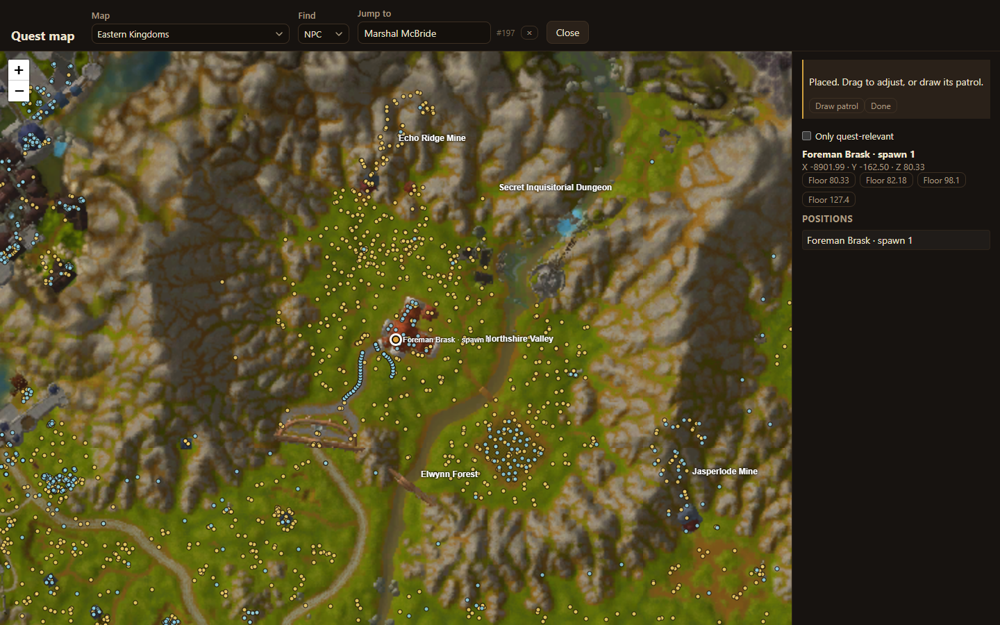

The **quest map** shows the world with your quest's NPCs and objects on it, and everything that already stands there. Use it to place spawns instead of reading coordinates with `.gps` in game.

Open it with **Map** in the quest's header, or with **Place on map** on a giver's card.

## Find a place

- **Map**: the continent or instance map, such as Eastern Kingdoms.
- **Jump to**: type an NPC or object that already exists to centre the map on it. **Find** chooses whether you search NPCs or objects.
- Zoom with **+** and **−** or the mouse wheel, and drag to move.

Existing spawns show as dots once you zoom in close enough. **Only quest-relevant** hides everything that is not part of your quest.

## Place a spawn

When the map asks, for example *Click where Foreman Brask should stand.*, click the spot. Drag a placed marker to adjust it.

The panel on the right shows the spawn's position. Where there are several floors, such as the ground and a building's upper storey, it offers each height as a **Floor** button; pick the one you mean.

## What the map needs

- The **server data folder** gives the relief shading, heights and floors.
- The **game client folder** gives the zone art and minimap.

Both are set when you [connect](/acore-quest-creator/getting-started/connect/). Without them the map still places spawns, but heights have to be checked in game.

Next: draw the NPC's [patrol](/acore-quest-creator/guides/patrols/).
