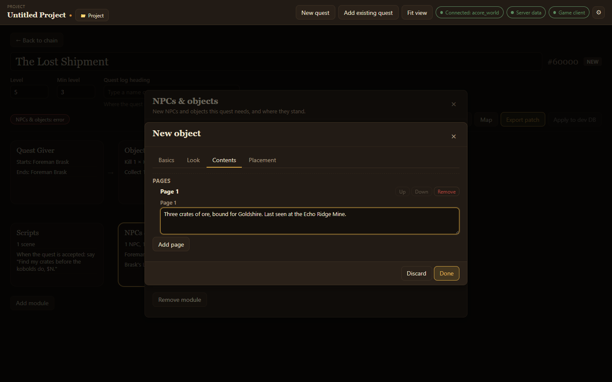

A **readable object** shows pages of text when a player uses it: a ledger, a note pinned to a door, a memorial plaque. **Usable objects** can show pages too.

## Make one

1. In **NPCs & objects**, choose **Add object**.
2. On **Basics**, give it a **Name** and set **Type** to **Readable**.
3. On **Look**, choose **Other ways** and browse models, for example `book` or `scroll`.
4. On **Contents**, choose **Add page** and write the text. Add as many pages as you need; using the object shows the first page, and the player turns to the next.
5. On **Placement**, add a spawn so it appears in the world.
6. Choose **Done**.

Use **Up** and **Down** to reorder pages and **Remove** to delete one.

After you apply the quest to your test server, the `.reload page_text` command in [Test in game](/acore-quest-creator/guides/test-in-game/) loads new pages without a restart. A new object itself appears only after a server restart.
