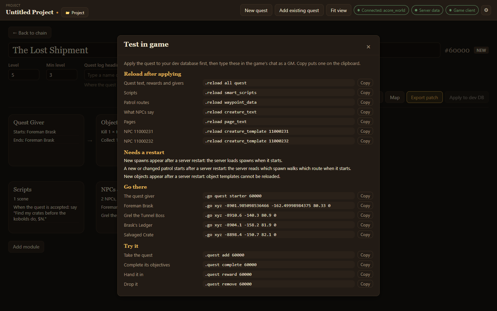

**Test in game**, in the quest's header, lists the chat commands to try the quest on your test server as a GM. **Copy** puts one on the clipboard.

Apply the quest to your dev database first (see [Exporting and applying](/acore-quest-creator/guides/export-and-apply/)), then use the commands in order.

## Reload after applying

Commands that load your changes without restarting the server: quest text, rewards and givers, scripts, patrol routes, what NPCs say, pages, and each new NPC's template. The list only shows the ones your quest needs.

## Needs a restart

Some changes only load when the server starts, and the panel says which:

- new spawns,
- a new or changed patrol,
- new objects.

## Go there

A `.go` command for the quest giver and for each new NPC and object, to travel straight to it.

## Try it

- **Take the quest**: `.quest add`
- **Complete its objectives**: `.quest complete`
- **Hand it in**: `.quest reward`
- **Drop it**: `.quest remove`
