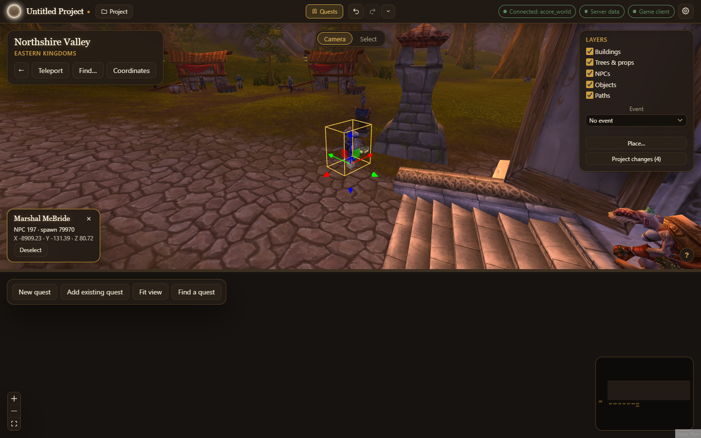
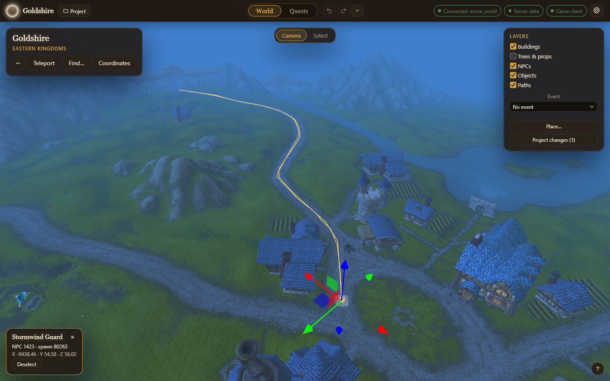
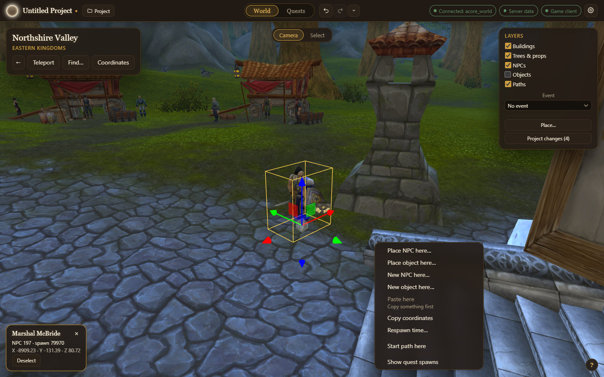
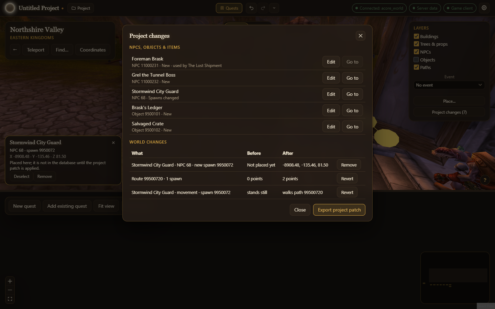

The **World** tab is where the app opens and where most work happens: the game world in 3D, drawn from your own game client. Walk it, place NPCs and objects that already exist, move them, draw the paths they walk, and tie them to the quest you have open. Changes to spawns that belong to no quest are kept as **world changes** and exported as a patch of their own.

## Before and after: fixing a route

The Stormwind Guard who walks between Goldshire and Northshire Valley follows the stock route, which leaves the road outside Goldshire and cuts across the grass. A project that does nothing else drags that stretch back onto the road. Select the guard and his route is drawn; with **Trees & props** hidden, the whole of it shows.

The edit is one entry in **Project changes**, and **Export project patch** writes it as the route's new points, with a revert patch that puts the stock route back. Every other spawn and route stays as the database has it.

The World needs the **game client folder**, set when you [connect](/azeroth-world-editor/getting-started/connect/). Without it the tab says so and offers Settings.

## Find your way

- The first time a project opens here, a **Welcome** offers well-known places to start, **Find an NPC or object**, **Start a quest** and **Just look around**.
- The card in the top left names the area under the camera. **Teleport** lists named places, with a box to find a place or zone. **Find…** searches NPCs and objects by name or ID and lists every spawn of the one you pick, nearest first; **Go** takes the camera there and selects it. **Coordinates** takes a map and an X, Y and Z.
- The World opens where you left it.
- **Back**, the arrow on the place card, returns the camera to where it was before the last jump: a Teleport, a Find, a **Go to**, a Coordinates **Go**, or the move to a quest you opened. Press it again to go further back, up to 20 jumps, as in a browser. **Alt+Left** does the same while the World is shown. Its tooltip names the place it will return to (**Back to** the place), and it is off when there is nowhere to go back to.

### Following a quest

Open a quest from the **Quests** tab and then switch to the World, and the camera is already there: it flies to the quest's giver, or its ender if it has no giver, or an objective if it has neither. If the quest has several, it picks the one nearest the camera on the current map. A quest with no spawns leaves the camera where it was. If you move the camera yourself before switching, it stays where you put it. **Back** takes you to where you were.

Two buttons do the same on demand:

- **Show in World**, in the quest editor and in the graph preview, switches to the World and takes the camera to the quest.
- **Go to _name_**, beside each giver, ender and objective that names an NPC or object with a spawn, takes the camera to that one's nearest spawn.

Without the world database, both buttons find only your project's own NPCs and objects and the spawns you moved or placed in the World. For anything else they say *Needs the world database*.

To move the camera:

| Input | Does |
| --- | --- |
| Right-drag | Look around |
| Left-drag | Orbit round the point under the cursor (Camera mode) |
| Middle-drag | Pan |
| Wheel | Move forward and back |
| **W** / **S**, **A** / **D** | Fly forward and back, strafe |
| **Q** / **E** | Turn left and right |
| **Space** / **X** | Rise and sink |
| **Shift** | Faster |

Keys work once the view has been clicked. The **?** in the bottom right lists every control.

## What is shown

The **Layers** card turns parts of the world on and off: **Buildings**, **Trees & props**, **NPCs**, **Objects** and **Paths**. Buildings are drawn with their furniture and props (the tables and barrels in an inn), which hide with them. With buildings hidden, clicks land on the ground under them.

**Event** draws the world during one game event: its NPCs and objects appear, and those it takes away go. **No event** is the everyday world; **All events** shows every spawn the database has.

## Select and move

Click an NPC or object to select it. Its card shows what it is and where it stands. Selecting an NPC shows its route and wander circle.

The bar at the top switches between **Camera** and **Select** (**Tab** flips it). In Select mode a left-drag draws a box round what to select, **Shift**-click adds, **Ctrl**-click takes away, and **Alt**+drag orbits.

With something selected:

- **G** moves it and **R** turns it, with the handles on the selection. A moved spawn drops onto the server's floor where you let go.
- On a shown route, click a point to pick it, **Shift**-click (Alt-click in Select mode) to add one, and **Delete** to remove the picked points. A route keeps at least two points.
- **O** turns on **Falloff**: nearby route points follow a move, less the further they are. **[** and **]** change its radius.
- **Ctrl+Z** and **Ctrl+Y** undo and redo, one whole move or turn at a time. They're the project's undo, so they also reach changes made elsewhere; see [Undo and redo](/azeroth-world-editor/guides/undo/).

When a route is walked by more than one spawn, the app asks before it changes it for all of them.

## The right-click menu

Right-click (without dragging) for a menu about what is under the cursor: a route point, an NPC or object, or the ground. An NPC or object you right-click is selected first. An item that cannot be used says why, such as *Copy something first*. The **ContextMenu** key and **Shift+F10** open it too.

### Place, copy and paste

- **Place NPC here…** and **Place object here…**: pick an existing NPC or object, and one is put down where you right-clicked, facing you, on the server's floor. **Place…** in the Layers card places one with each click instead, until **Esc**.
- **Copy**, **Paste here** and **Duplicate** (also **Ctrl+C**, **Ctrl+V** and **Ctrl+D**): a copied group keeps its layout and facing. **Ctrl+V** pastes under the cursor, and Duplicate puts the copy beside the original. A paste copies what a spawn is, how it faces, its respawn time and how far it wanders. It does not copy a path: a pasted NPC that walked a path stands still, and you draw it a new one.
- **Respawn time…**: how long a spawn takes to come back after it dies or is despawned, in minutes and seconds. It starts from the spawn's current time. With several spawns selected the item reads **Respawn time of _n_ spawns…** and sets them all; if they differ the boxes start empty. It works on any spawn, a new one, one you placed, or one the database already has.
- **Remove**: takes away a spawn you placed. Spawns already in the database are not deleted.
- **Copy coordinates**: puts `.go xyz` with the place's X, Y, Z and map on the clipboard, ready to paste in game.

Placing, pasting and removing are undone with **Ctrl+Z** like any other change.

### How an NPC moves

- **Start path here**: with one NPC selected that has no route, right-click the ground where its path should begin. Each click then adds the next point. **Enter** or **Esc** finishes, **Ctrl+Z** takes back the last point, and **Cancel path** puts everything back. A path needs at least two points.
- **Change wander distance…**: how far the NPC roams from where it stands, 0 to 100 yards. Its circle follows what you type.
- **Remove path**: the NPC stands still. A path the database already has is left in place for any other NPC that walks it.

These work for any NPC, whether the database has it or you made it.

### Your quest

Right-click an NPC or object and open **Quests**:

- With a quest open, **Set as quest giver**, **Set as quest ender** and **Add as kill objective** (**Add as use objective** for an object) give it that part in the quest. When it already has the part, the item reads **Remove as…** and takes it away. See [quest givers and enders](/azeroth-world-editor/guides/givers-and-enders/).
- On an NPC, **Start a new quest from this NPC** makes a quest it gives and takes back. With a quest open, **Start the next quest in this chain** does the same and puts the new quest after the open one.

On the ground, with a quest open:

- **Show quest spawns** and **Show chain spawns** ring every spawn the quest (or its whole chain) uses and list them in the Find dialog by quest and part, so you can jump to any of them. **Hide quest spawns** takes the rings away.

### New NPCs and objects

- **New NPC here…** and **New object here…** make a new [NPC or object](/azeroth-world-editor/guides/npcs-and-objects/) for the project, with a spawn where you right-clicked, and open its editor. No quest needs to be open.
- On any NPC or object, **Edit NPC…** or **Edit object…** opens its editor. For one the database already has this needs the world database connected; see [Change an NPC or object that already exists](/azeroth-world-editor/guides/npcs-and-objects/#change-one-that-already-exists).
- On an object, **Make lootable…** turns it into a chest and opens its loot. **Stop being lootable** turns it back.

An NPC or object is the project's, and a quest uses it by naming it. The project's NPCs and objects are drawn and edited in the World whether or not a quest is open. A move, or a path you give one, stays with the NPC, whichever quest uses it.

### Spawn groups

Select two or more spawns and choose **Group these spawns…** to make a [spawn group](/azeroth-world-editor/guides/spawn-groups/): only some of them are up at a time. On a spawn that is already in a group, **Spawn group ▸** holds **Edit group…**, **Show group** and **Remove from group**. Selecting a pooled spawn rings the rest of its group, and the card lists each member's chance. In **Find…**, the **Spawn group** option searches groups by name.

## Project changes

**Project changes (_n_)** in the Layers card lists everything the project adds to or changes in the world database, outside its quests.

First comes the project's list of NPCs, objects and items: every one you made, and every existing one you changed. Each row says what changed, which quests use it and how many spawns it has. **Edit** opens its editor, and **Go to** takes the camera to its spawn. The summary is one or more of:

- **New**: you made it.
- **Spawns changed**: you moved, turned, placed or changed the respawn time of one of its spawns.
- **Movement changed**: how it moves changed, such as its wander distance.
- **Path changed**: a route it walks changed.
- **Details changed**: you edited the NPC, object or item itself.
- **Group changed**: one of its spawns joined, left or was changed in a spawn group.

The quest panel shows the same list; see [NPCs and objects](/azeroth-world-editor/guides/npcs-and-objects/).

Then come changes to spawns already in the database: spawns moved or turned, respawn times, routes changed, spawns placed, NPCs' movement and spawn groups, each with what it was before and after. **Revert** or **Remove** takes one back; a new path and the movement that walks it go back together.

**Export project patch** writes all of it, and a patch that undoes it. If one of the new NPCs, objects or items has an error, it lists what to fix first. See [exporting and applying](/azeroth-world-editor/guides/export-and-apply/#the-project-patch).

:::note
A change shows as *Changed in the database since* when the world database no longer matches what it was when you first changed it. Check those before applying the patch.
:::
