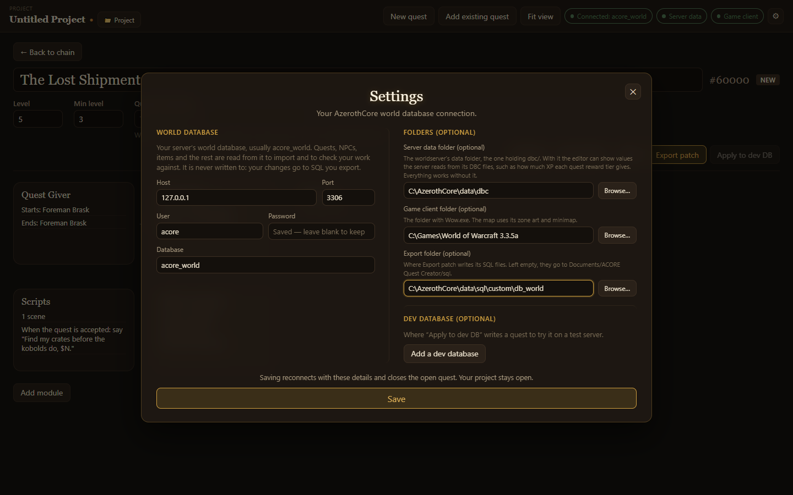

Choose **⚙** in the top bar to open **Settings**. It holds the same fields as the login screen.

## World database

| Setting | Meaning |
| --- | --- |
| Host | The MySQL server, such as `127.0.0.1`. |
| Port | The MySQL port, usually `3306`. |
| User | A MySQL user that can read the world database. |
| Password | That user's password. Stored encrypted; leave blank to keep the saved one. |
| Database | The world database, usually `acore_world`. |

The world database is only ever read.

## Game files

| Setting | Meaning |
| --- | --- |
| Server data folder | The worldserver's data folder, the one holding `dbc/`. Adds XP values, name search for spells and models, ground height and floors on the map. |
| Game client folder | The folder with `Wow.exe`. Adds zone art and the minimap to the quest map. |

Both are optional.

## Dev database

**Add a dev database** asks for a second host, port, user, password and database: a test server's world database that **Apply to dev DB** writes to. **Remove dev database** turns it off again.

## Saving

**Save** reconnects with the new details. It closes the open quest; your project stays open. If the connection fails, the error shows in the dialog and the app stays connected with the old details.

## Where the app keeps its data

Connection details, recent projects, recovery copies and cached map tiles live in the app's data folder:

| System | Folder |
| --- | --- |
| Windows | `%APPDATA%\ACORE Quest Creator` |
| macOS | `~/Library/Application Support/ACORE Quest Creator` |
| Linux | `~/.config/ACORE Quest Creator` |

Exported SQL patches go to `Documents/ACORE Quest Creator/sql`. Projects are saved wherever you choose, as `.aqc` files.
