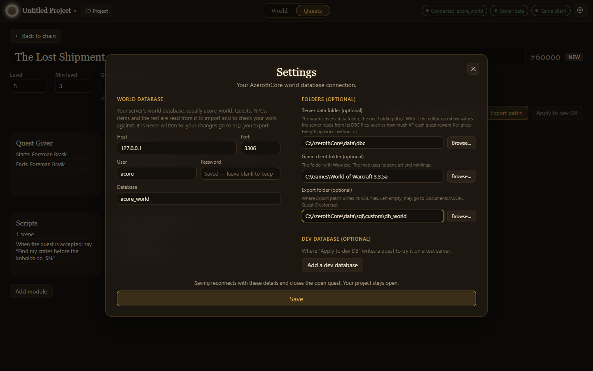

Choose **Settings** (the cog) at the right of the top bar. It holds the same fields as the login screen.

## World database

| Setting | Meaning |
| --- | --- |
| Host | The MySQL server, such as `127.0.0.1`. |
| Port | The MySQL port, usually `3306`. |
| User | A MySQL user that can read the world database. |
| Password | That user's password. Stored encrypted; leave blank to keep the saved one. |
| Database | The world database, usually `acore_world`. |

The world database is only ever read.

## Folders

| Setting | Meaning |
| --- | --- |
| Server data folder | The worldserver's data folder, the one holding `dbc/`. Adds XP values, name search for spells and models, and ground height and floors in the World. |
| Game client folder | The folder with `Wow.exe`. The World is drawn from it in 3D. |
| Export folder | Where **Export patch** writes SQL files. Empty: `Documents/Azeroth World Editor/sql`. |

All three are optional.

## Dev database

**Add a dev database** asks for a second host, port, user, password and database: a test server's world database that **Apply to dev DB** writes to. **Remove dev database** turns it off again.

## MCP / AI

The **MCP / AI** tab turns on the MCP server that lets an AI assistant work in the open project. See [Working with an AI assistant](/azeroth-world-editor/guides/ai-mcp/).

| Setting | Meaning |
| --- | --- |
| Allow AI to edit this project | Starts or stops the server. Off by default; it applies at once. |
| Port | The port it listens on, from 1024 to 65535 (default 47600). |
| Allow lookups on warcraft.wiki.gg | Lets the assistant search and read pages on the Warcraft wiki. Off by default; only its search words are sent. Independent of the server switch. |
| Token | What a client sends as `Authorization: Bearer …`. Hidden until you press **Show**; **Make a new token** replaces it. |

## Saving

**Save** reconnects with the new details. It closes the open quest; your project stays open. If the connection fails, the error shows in the dialog and the app stays connected with the old details.

## Preferences

The **Preferences** tab holds how the app looks on this computer. **Quest dock** puts the **Quests** dock **Under the world** or **Beside the world**; each side remembers its own size. Drag the bar between the World and the dock to resize it. Preferences are kept on this computer, not in the project. The **✕** in the corner closes Settings from either tab.

**Debug mode**, under **Diagnostics**, is off by default. While it is on, the app records a timeline of key codes, focus changes, window and dialog events, errors and the 3D view's frame rate and draw calls, in memory and in a log file (shown under the switch), so a fault that only appears in the live window can be traced. It never records the characters you type or what is in a field. An [AI assistant](/azeroth-world-editor/guides/ai-mcp/#debug-mode-and-the-screenshot-tool) can read the timeline; only you can switch it on.

## Where the app keeps its data

Connection details, recent projects and recovery copies live in the app's data folder:

| System | Folder |
| --- | --- |
| Windows | `%APPDATA%\azeroth-world-editor` |
| macOS | `~/Library/Application Support/azeroth-world-editor` |
| Linux | `~/.config/azeroth-world-editor` |

Exported SQL patches go to the **Export folder**, or `Documents/Azeroth World Editor/sql` when none is set. Projects are saved wherever you choose, as `.awe` files (older versions saved `.aqc`, which still open).
